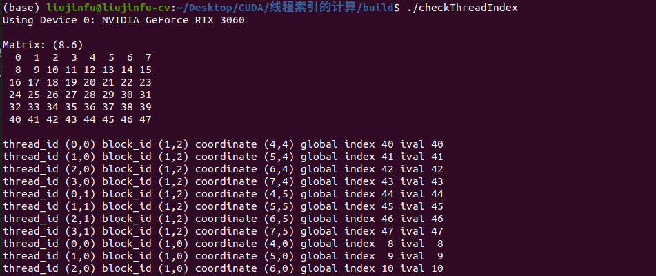
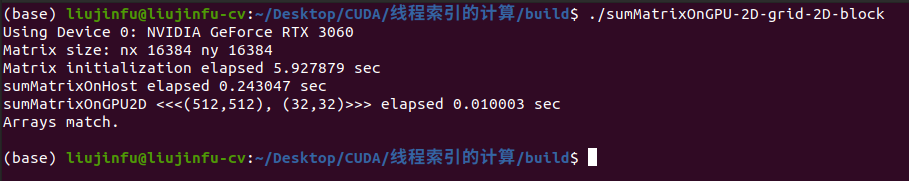
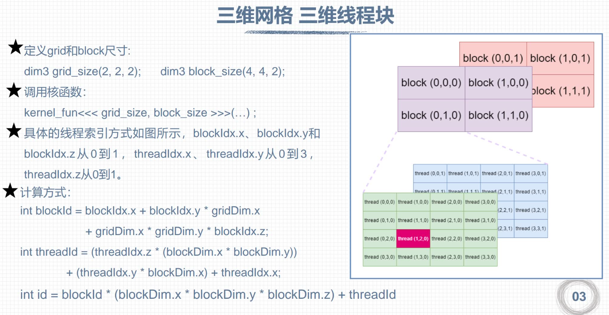

# 基本准则
要计算多维网格多维线程块中的全局线程索引，一般遵照以下准则
```
1. 计算单个线程在线程块中的索引threadIdx;
2. 计算线程所在的线程块在所有线程块的索引blockIdx;
3. 线程的全局索引为: threadIdx + blockIdx*单个block的线程总数;
```
代码实例:
```C++
// checkThreadIndex.cu中的二维网格和二维线程块
...
int threadidx = threadIdx.x + threadIdx.y*blockDim.x; // 1.计算单个线程在线程块的索引 threadidx
int blockidx = blockIdx.x + blockIdx.y*gridDim.x; // 2.计算线程所在线程块在全部线程块的索引 blockidx
unsigned int idx = threadidx + blockidx*(blockDim.x*blockDim.y); // 3.线程的全局索引: idx = threadidx + blockidx*单个线程块的线程数
...
```

# 编译运行
```bash
nvcc checkThreadIndex.cu -o checkThreadIndex
./checkThreadIndex
nvcc sumMatrixOnGPU-2D-grid-2D-block.cu -o sumMatrixOnGPU-2D-grid-2D-block
./sumMatrixOnGPU-2D-grid-2D-block

# or
mkdir build && cd build
cmake ..
make
./checkThreadIndex
./sumMatrixOnGPU-2D-grid-2D-block
```
<div align=center>

</div>
<div align=center>

</div>

# 知识拓展
## 多维情况:  
对于下图的三维网格和三维线程块而言，基本准则同样适用:
<div align=center>

</div>

```
1. threadId表示单个线程在线程块中的索引
2. blockId表示所在线程块在全部线程块中的索引
3. 线程的全局索引id = threadId + blockId*单个线程块的线程数 (单个三维线程块的线程数为:blockDim.x*blockDim y*blockDim.z)
```

## 限制情况:
```markdown
1. 网格大小限制:
    gridDim.x 的最大值为 2^31 - 1
    gridDim.y 的最大值为 2^16 - 1
    gridDim.z 的最大值为 2^16 - 1
2. 线程块大小限制:
    blockDim.x 的最大值为 1024
    blockDim.y 的最大值为 1024
    blockDim.z 的最大值为 64
3. 线程块总的大小最大为 1024
```