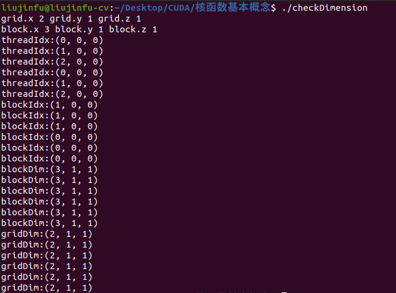
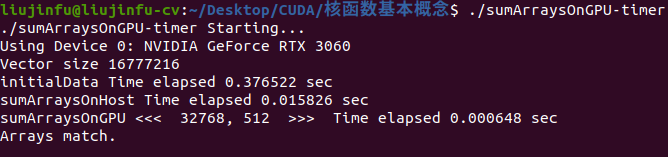

# CUDA程序
## 一般流程
    1. 把数据从CPU内存拷贝到GPU内存;
    2. 调用核函数对存储在GPU内存中的数据进行操作;
    3. 将数据从GPU内存传送回到CPU内存。
## 内存分配
```C++
// 在 GPU 中申请 size 字节的内存，并返回指向分配内存的指针 devPtr 
cudaError_t cudaMalloc(void** devPtr, size_t size);
```
内存分配成功，函数返回 cudaSuccess，否则返回 cudaErrorMemoryAllocation
## 数据拷贝
```C++
cudaError_t cudaMemcpy(void* dst, const void* src, size_t count, cudaMemcpyKind kind);
// 常用的kind有:
// cudaMemcpyHostToDevice 表示从主机端拷贝到设备端
// cudaMemcpyDeviceToHost 表示从设备端拷贝到主机端
```
在GPU内存层次结构中，最主要的两种内存是全局内存和共享内存。当数据被转移到GPU的全局内存后，主机端会调用核函数。  
一旦内核被调用，控制权会立刻被传回主机端; 内核与主机是异步的，即核函数在GPU中运行，主机CPU可以同时执行其他函数。  
调用cudaMemcpy会导致主机运行阻塞，直到数据完成拷贝。

# 线程块网格和线程块
CUDA线程结构由线程块网格和线程块组成。  
由一个内核启动（同一个核函数）所产生的所有线程统称为一个网格，同一个网格中的所有线程共享相同的全局内存空间。
一个网格由多个线程块构成，一个线程块包含一组线程。不同块的线程不能协作。
## 坐标变量
    blockIdx 表示线程块在线程网格内的索引。
    threadIdx 表示线程块内线程的索引。
    blockDim 表示线程块的维度，用每个线程块中的线程数来表示。
    gridDim 表示线程格的维度，用每个线程格中的线程数来表示。
坐标变量是基于unit3定义的CUDA内置的向量类型。  
通常一个线程格会被组织成线程块的二维数组形式，一个线程块会被组织成线程的三维数组形式。  
手动定义的dim3类型的网格和线程块数量仅在主机端可见，而unit3类型的内置变量仅在设备端可见。
```C++
// 主机端
dim3 block // 手动定义
block.x, block.y, block.z // 访问
// 设备端
blockDim.x, blockDim.y, blockDim.z // 内置线程块变量的大小
```
对于给定的数据大小，一般按以下步骤确定网格和线程块尺寸: 
``` 
1. 确定块的大小。  
2. 在已知数据大小和线程块大小的基础上计算网格维度。
```
# 核函数调用
```C++
// 调用语法
kernel_name <<<grid, block>>>(argument list);
// <<<>>>运算符中第一个值表示网格维度，即启动的线程块的数目
// 第二个值表示线程块维度，即每个线程块中线程的数目
```
由于核函数的调用与主机线程是异步的，可以通过同步函数强制主机端程序等待所有的核函数执行结束。
```C++
cudaError_t cudaDeviceSynchronize(void);
```
## 函数类型限定符
核函数是用函数限定符 __global__ 声明，核函数必须具有一个 void 返回类型。
```C++
__global__ void kernel_name(argument list);
// 常用的函数类型限定符包括:
// __global__ 在设备端执行，从主机端调用
// __device__ 在设备端执行，从设备端调用
// __host__ 在主机端执行，从主机端调用
```
## 核函数的限制
```
1. 只能访问设备内存
2. 必须具有void返回类型
3. 不支持可变数量的参数
4. 不支持静态变量
5. 显示异步行为
```
## 验证核函数
```
1. 在主机端编写一个主机函数执行相同的逻辑，对比来验证核函数的执行结果。
2. 将执行参数设置为<<<1, 1>>>，强制使用一个线程块和一个线程来执行，模拟串行执行。
```

# 本节代码
## 编译运行
```bash
nvcc checkDimension.cu -o checkDimension
./checkDimension
nvcc sumArraysOnGPU-timer.cu -o sumArraysOnGPU-timer
./sumArraysOnGPU-timer
# or
mkdir build && cd build
cmake ..
make
./checkDimension
./sumArraysOnGPU-timer
```
## 执行结果
<div align=center>

</div>
<div align=center>

</div>

