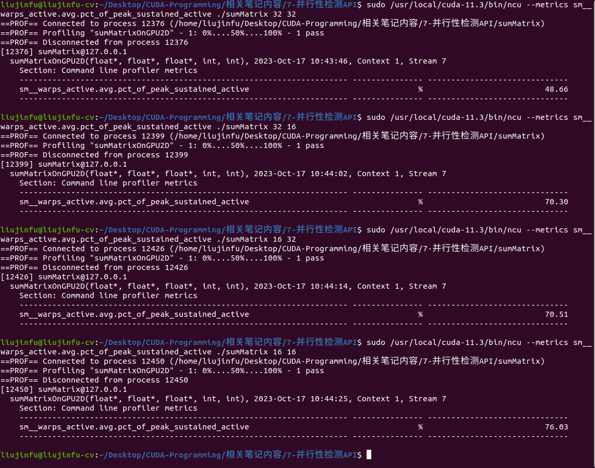

# nvprof
在CUDA编程中，可以利用nvprof来检查程序的占用率、内存操作效率、全局加载效率，通过以上指标评估程序的并行性。

# achieved_occupancy检查占用率
占用率的定义如下:
$$ 占用率 = \frac{活跃线程束数量}{最大线程束数量}$$
```C++
// 利用nvprof --metrics achieved_occupancy检查占用率
nvprof --metrics achieved_occupancy ./sumMatrix 32 32
nvprof --metrics achieved_occupancy ./sumMatrix 32 16
nvprof --metrics achieved_occupancy ./sumMatrix 16 32
nvprof --metrics achieved_occupancy ./sumMatrix 16 16
// 由于新版本的CUDA不再支持nvprof --metrics achieved_occupancy，因此可以使用以下命令替代:
sudo /usr/local/cuda-11.3/bin/ncu --metrics sm__warps_active.avg.pct_of_peak_sustained_active ./sumMatrix 32 32
sudo /usr/local/cuda-11.3/bin/ncu --metrics sm__warps_active.avg.pct_of_peak_sustained_active ./sumMatrix 32 16
sudo /usr/local/cuda-11.3/bin/ncu --metrics sm__warps_active.avg.pct_of_peak_sustained_active ./sumMatrix 16 32
sudo /usr/local/cuda-11.3/bin/ncu --metrics sm__warps_active.avg.pct_of_peak_sustained_active ./sumMatrix 16 16
```
<div align=center>

</div>

# gld_throughout检查内存读取效率
```C++
// 利用nvprof --metrics gld_throughout检查占用率
nvprof --metrics gld_throughout ./sumMatrix 32 32
nvprof --metrics gld_throughout ./sumMatrix 32 16
nvprof --metrics gld_throughout ./sumMatrix 16 32
nvprof --metrics gld_throughout ./sumMatrix 16 16
// 由于新版本的CUDA不再支持nvprof --metrics gld_throughout，因此可以使用以下命令替代:
sudo /usr/local/cuda-11.3/bin/ncu --metrics l1tex__t_bytes_pipe_lsu_mem_global_op_ld.sum.per_second ./sumMatrix 32 32
sudo /usr/local/cuda-11.3/bin/ncu --metrics l1tex__t_bytes_pipe_lsu_mem_global_op_ld.sum.per_second ./sumMatrix 32 16
sudo /usr/local/cuda-11.3/bin/ncu --metrics l1tex__t_bytes_pipe_lsu_mem_global_op_ld.sum.per_second ./sumMatrix 16 32
sudo /usr/local/cuda-11.3/bin/ncu --metrics l1tex__t_bytes_pipe_lsu_mem_global_op_ld.sum.per_second ./sumMatrix 16 16
```
<div align=center>

</div>

# gld_efficiency检查全局加载效率
全局加载效率定义如下:
$$ 全局加载效率 = \frac{被请求的全局加载吞吐量}{所需的全局加载吞吐量}$$
```C++
// 利用nvprof --metrics gld_efficiency检查占用率
nvprof --metrics gld_efficiency ./sumMatrix 32 32
nvprof --metrics gld_efficiency ./sumMatrix 32 16
nvprof --metrics gld_efficiency ./sumMatrix 16 32
nvprof --metrics gld_efficiency ./sumMatrix 16 16
// 由于新版本的CUDA不再支持nvprof --metrics gld_throughout，因此可以使用以下命令替代:
sudo /usr/local/cuda-11.3/bin/ncu --metrics smsp__sass_average_data_bytes_per_sector_mem_global_op_ld.pct ./sumMatrix 32 32
sudo /usr/local/cuda-11.3/bin/ncu --metrics smsp__sass_average_data_bytes_per_sector_mem_global_op_ld.pct ./sumMatrix 32 16
sudo /usr/local/cuda-11.3/bin/ncu --metrics smsp__sass_average_data_bytes_per_sector_mem_global_op_ld.pct ./sumMatrix 16 32
sudo /usr/local/cuda-11.3/bin/ncu --metrics smsp__sass_average_data_bytes_per_sector_mem_global_op_ld.pct ./sumMatrix 16 16
```
<div align=center>

</div>
上面的测试结果虽然所有的全局加载效率都为100，但一般来说为了提高效率，都会把线程块最内层的维度设置为线程束大小的倍数。

# 增加并行性
一般来说，增加并行性会提高CUDA程序的效率，例如可以通过将线程块最内层维度(block.x)设置为线程束大小的倍数，来提高加载效率。  
新旧API参数的对照可以参考: [NsightComputeCli](https://docs.nvidia.com/nsight-compute/NsightComputeCli/index.html)