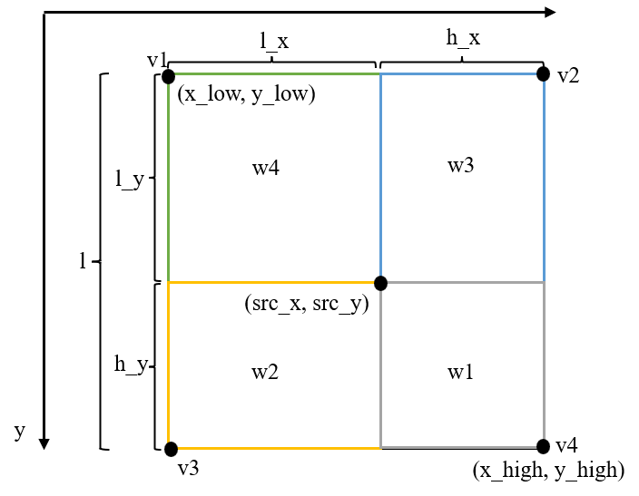

# 仿射变换
本笔记基于YoloV5前处理中使用的仿射变换算法，完成步骤如下:

# 1--缩放因子
$$scale = min(\frac{dst_h}{src_h}, \frac{dst_w}{src_w})$$ 
其中 $dst_h$ 和 $dst_w$ 表示变换后目标图像的高和宽， $src_h$ 和 $src_w$ 表示变换前源图像的高和宽

# 2--仿射变换矩阵

其中(src_x, src_y)表示变换前源图像的坐标，(dst_x, dst_y)表示变换后目标图像的坐标。

# 3--逆仿射变换矩阵
```C++
// 可以通过opencv提供的API计算计算
cv::invertAffineTransform(transform_M, Inverse_transform_M);
```

# 4--坐标对应
根据逆变换矩阵，可以求解目标图像的坐标对应在源图像中的坐标。

# 5--双线性插值
基于双线性插值，对于源图像中的一点($(src_x, src_y)$)，利用其四周的四个点v1, v2, v3, v4来计算三通道的值。</br>
$$c0 = w1\*v1[0]+w2\*v2[0]+w3\*v3[0] + w4\*v4[0]$$
$$c1 = w1\*v1[1] + w2\*v2[1] + w3\*v3[1] + w4\*v4[1]$$
$$c2 = w1\*v1[2] + w2\*v2[2] + w3\*v3[2] + w4\*v4[2]$$



# 6--代码展示
## 主函数
```C++
#include "warpaffine.h"
#include "cuda_utils.h"

int main(int argc, char *argv[]){
    cv::Mat src_img = cv::imread("../test1.jpg"); // 读取测试图片

    int dst_width = 640, dst_height = 640; // 设置仿射变换后图片的尺寸
    cv::Mat dst_img(cv::Size(dst_width, dst_height), CV_8UC3); // 仿射变换后保存的图片
    
    // 申请CUDA内存
    uint8_t* psrc_device = nullptr; // 输入数据内存
    uint8_t* pdst_device = nullptr; // 输出数据内存
    size_t src_size = src_img.rows * src_img.cols * 3;
    size_t dst_size = dst_width * dst_height * 3;
    CUDA_CHECK(cudaMalloc(&psrc_device, src_size));
    CUDA_CHECK(cudaMalloc(&pdst_device, dst_size));
    CUDA_CHECK(cudaMemcpy(psrc_device, src_img.data, src_size, cudaMemcpyHostToDevice));

    // 执行仿射变换
    warpaffine(psrc_device, src_img.cols, src_img.rows, pdst_device, dst_width, dst_height);

    // 将变换结果拷贝回CPU
    CUDA_CHECK(cudaMemcpy(dst_img.data, pdst_device, dst_size, cudaMemcpyDeviceToHost));

    // 释放内存
    CUDA_CHECK(cudaFree(psrc_device));
    CUDA_CHECK(cudaFree(pdst_device));

    // 展示仿射变换后的结果
    cv::imshow("output", dst_img);
    cv::waitKey(0);
    return 0;
}
```
## 核函数
```C++
#include "opencv2/opencv.hpp"
#include "cuda_utils.h"
typedef unsigned char uint8_t;

// 仿射变换的矩阵 2*3
struct AffineMatrix{
    float value[6];
};

// 利用双线性插值实现仿射变换
__global__ void warpaffine_kernel(uint8_t* src, 
                                int src_line_size, 
                                int src_width, 
                                int src_height, 
                                uint8_t* dst, 
                                int dst_line_size,
                                int dst_width, 
                                int dst_height, 
                                uint8_t const_value_st, 
                                AffineMatrix d2s){

    // 线程索引                                
    int dx = blockDim.x * blockIdx.x + threadIdx.x;
    int dy = blockDim.y * blockIdx.y + threadIdx.y;
    if(dx >= dst_width || dy >= dst_height) return;

    // 取d2s逆仿射变换矩阵
    float m_x1 = d2s.value[0];
    float m_y1 = d2s.value[1];
    float m_z1 = d2s.value[2];
    float m_x2 = d2s.value[3];
    float m_y2 = d2s.value[4];
    float m_z2 = d2s.value[5];
    // 通过逆仿射变换矩阵求解对应在原图像的坐标
    float src_x = m_x1 * dx + m_y1 * dy + m_z1 + 0.5f; 
    float src_y = m_x2 * dx + m_y2 * dy + m_z2 + 0.5f;

    float c0, c1, c2;
    if (src_x <= -1 || src_x >= src_width || src_y <= -1 || src_y >= src_height){
        // 超出范围的用常值替代
        c0 = const_value_st;
        c1 = const_value_st;
        c2 = const_value_st;
    } 
    else{
        int y_low = floorf(src_y); // 向下取整获取左上角坐标
        int x_low = floorf(src_x);
        int y_high = y_low + 1;
        int x_high = x_low + 1; // 右下角坐标

        uint8_t const_value[] = {const_value_st, const_value_st, const_value_st};
        float ly = src_y - y_low;
        float lx = src_x - x_low;
        float hy = 1 - ly;
        float hx = 1 - lx;
        // w1表示右下角坐标的权重, w2表示右上角坐标
        float w1 = hy * hx, w2 = hy * lx, w3 = ly * hx, w4 = ly * lx; // 四个点的权重，用面积来表示
        uint8_t* v1 = const_value;
        uint8_t* v2 = const_value;
        uint8_t* v3 = const_value;
        uint8_t* v4 = const_value;

        // 计算上下左右四个点对应在内存的位置
        if (y_low >= 0){
            if (x_low >= 0) v1 = src + y_low * src_line_size + x_low * 3; 
            if (x_high < src_width) v2 = src + y_low * src_line_size + x_high * 3;
        }
        if (y_high < src_height){
            if (x_low >= 0) v3 = src + y_high * src_line_size + x_low * 3;
            if (x_high < src_width) v4 = src + y_high * src_line_size + x_high * 3;
        }

        // 利用上下四个点三通道的值，以及对应的权重来实现双线性插值
        c0 = w1 * v1[0] + w2 * v2[0] + w3 * v3[0] + w4 * v4[0];
        c1 = w1 * v1[1] + w2 * v2[1] + w3 * v3[1] + w4 * v4[1];
        c2 = w1 * v1[2] + w2 * v2[2] + w3 * v3[2] + w4 * v4[2];
    }

    uint8_t* pdst = dst + dy*dst_line_size + dx*3; // 利用线程索引计算像素的内存位置
    pdst[0] = c0; // b
    pdst[1] = c1; // g
    pdst[2] = c2; // r
}

// 仿射变换
void warpaffine(uint8_t* src, int src_width, int src_height, uint8_t* dst, int dst_width, int dst_height){

    AffineMatrix s2d, d2s; // s2d 表示将src变换为dst图像的仿射矩阵，d2s则表示将dst变换为src的逆变换矩阵
    float scale = std::min(dst_height / (float)src_height, dst_width / (float)src_width); // 缩放比例: dst/src，取较小值
    // 对仿射变换矩阵赋值
    s2d.value[0] = scale;
    s2d.value[1] = 0;
    s2d.value[2] = -scale * src_width  * 0.5  + dst_width * 0.5 + scale * 0.5 - 0.5;
    s2d.value[3] = 0;
    s2d.value[4] = scale;
    s2d.value[5] = -scale * src_height * 0.5 + dst_height * 0.5 + scale * 0.5 - 0.5;

    cv::Mat m2x3_s2d(2, 3, CV_32F, s2d.value); // 仿射变换矩阵
    cv::Mat m2x3_d2s(2, 3, CV_32F, d2s.value); // 仿射逆变换矩阵
    cv::invertAffineTransform(m2x3_s2d, m2x3_d2s); // 通过s2d计算逆变换矩阵d2s

    memcpy(d2s.value, m2x3_d2s.ptr<float>(0), sizeof(d2s.value));

    // 设置线程格和线程块大小
    dim3 block_size(32, 32);
    dim3 grid_size((dst_width + 31) / 32, (dst_height + 31) / 32);

    // 执行核函数
    warpaffine_kernel<<<grid_size, block_size, 0, nullptr>>>(
        src, 
        src_width * 3, 
        src_width,
        src_height, 
        dst, 
        dst_width * 3,
        dst_width,
        dst_height, 
        128, 
        d2s);
}
```
